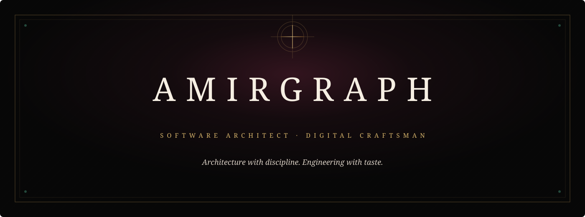

  

  <a href="https://github.com/amirgraph">GitHub</a>&nbsp;&nbsp;·&nbsp;&nbsp;
  <a href="https://example.com">Website</a>&nbsp;&nbsp;·&nbsp;&nbsp;
  <a href="https://www.linkedin.com/in/your-handle">LinkedIn</a>&nbsp;&nbsp;·&nbsp;&nbsp;
  <a href="https://x.com/your-handle">X</a>

 

  
   
  EST. IN CURIOSITY&nbsp;&nbsp;·&nbsp;&nbsp;BUILT WITH DISCIPLINE
    
  

## About

I build digital systems with a focus on architecture, reliability, and elegant execution. My work sits where rigorous engineering meets thoughtful design: turning complex requirements into software that feels clear, deliberate, and built to endure.

Curiosity shapes the questions. Discipline shapes the result.

 

## The Craft

<table>
  <tr>
    <td width="50%"><strong>01 · Backend Architecture</strong> Reliable services, clean boundaries, durable foundations.</td>
    <td width="50%"><strong>02 · System Design</strong> Complex systems composed with clarity and intent.</td>
  </tr>
  <tr>
    <td width="50%"><strong>03 · Automation</strong> Repeatable operations with fewer points of friction.</td>
    <td width="50%"><strong>04 · Infrastructure</strong> Practical deployment, networking, and resilience.</td>
  </tr>
  <tr>
    <td width="50%"><strong>05 · Web Technologies</strong> Focused interfaces supported by capable systems.</td>
    <td width="50%"><strong>06 · AI Systems</strong> Useful intelligence applied with care and restraint.</td>
  </tr>
</table>

 

## Selected Works

<table>
  <tr>
    <td width="18%" align="center">
      
       ARCHIVE · 001
    </td>
    <td width="82%">
      <h3>XUI Reseller</h3>
      
A one-command, multi-server platform for deploying and operating resilient network services, a reseller panel, and Telegram-led automation.

      
<strong>COMPOSITION</strong>&nbsp;&nbsp; Node.js · Express · SQLite · nginx · Xray · WARP · Bash

      
<strong>Why it matters.</strong> It brings installation, orchestration, clean-IP discovery, backups, subscriptions, and commercial operations into one coherent system—reducing a fragile manual process to a repeatable deployment.

      <a href="https://github.com/amirgraph/xui-reseller"><strong>Examine the repository →</strong></a>
    </td>
  </tr>
</table>

 

  
    
  <em>Precision creates simplicity. Simplicity gives good work longevity.</em>
    
  

 

## The Ledger

  <picture>
    <source media="(prefers-color-scheme: dark)" srcset="https://raw.githubusercontent.com/amirgraph/amirgraph/output/github-contribution-grid-snake-dark.svg" />
    <source media="(prefers-color-scheme: light)" srcset="https://raw.githubusercontent.com/amirgraph/amirgraph/output/github-contribution-grid-snake.svg" />
    
  </picture>

 

## Correspondence

For thoughtful collaborations, technical conversations, or considered new work:

  <a href="mailto:hello@example.com">Private correspondence</a>&nbsp;&nbsp;·&nbsp;&nbsp;
  <a href="https://www.linkedin.com/in/your-handle">LinkedIn</a>&nbsp;&nbsp;·&nbsp;&nbsp;
  <a href="https://x.com/your-handle">X</a>

 

  

